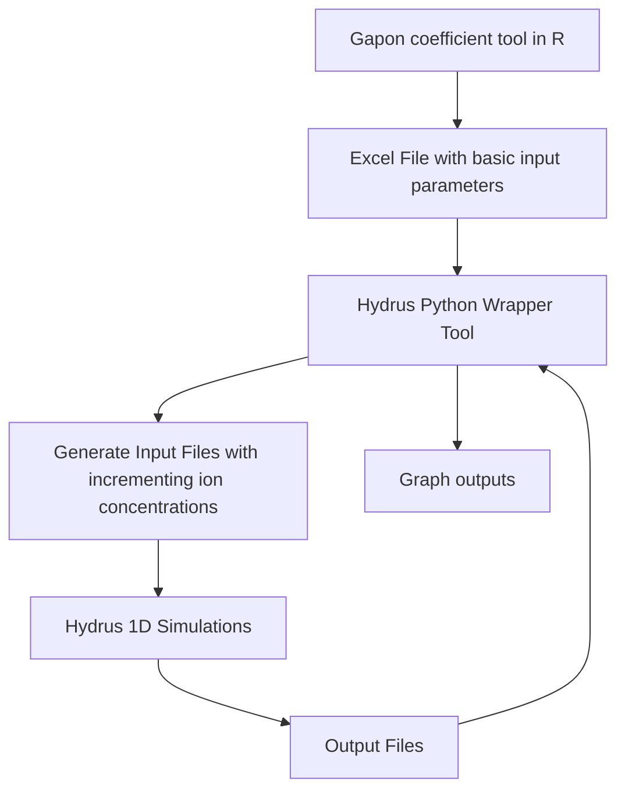

# Hydrus-1D Monte Carlo Analysis
**Created by:** 

A.J. Brown

Agricultural Data Scientist

Ansley.Brown@colostate.edu

---

## Project Description
This tool was created to run Monte Carlo analysis in the soil geo-chemi-physical model, [Hydrus 1D](https://www.pc-progress.com/en/Default.aspx?hydrus-1d),
to see the impact of the changing soil and water ion concentrations on soil solution electrical conductivity (EC).

It essentially creates new input files for Hydrus 1D, runs the model, collects output files, extracts EC data, and then repeats until you have reached the end of your desired ion iteration increment. These outputs are then graphed to show the impact of the changing ion concentrations on EC.

I never created a how-to doc for it unfortunately, and I'm not actively working 
on it, so if you are interested in using this code, please contact me directly at ansleybrown1337@gmail.com.

Cheers,

AJ